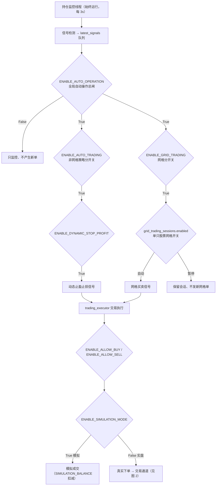
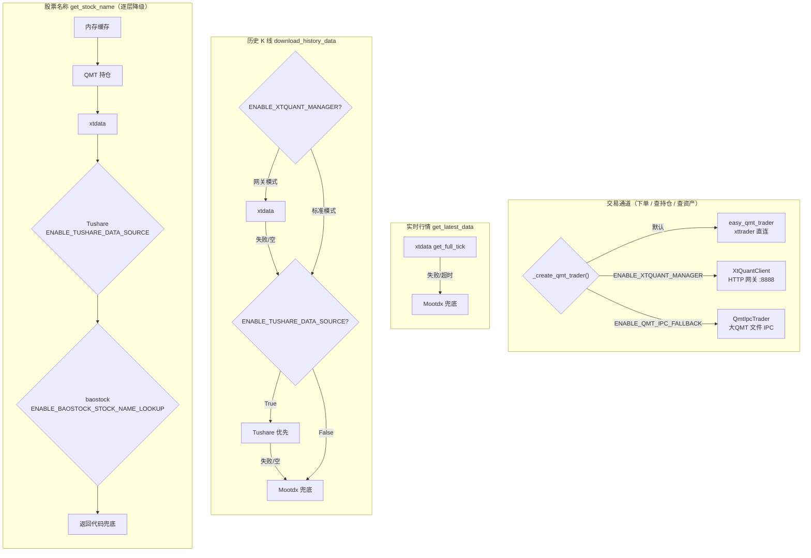

# 配置参考

所有可配置参数集中在 `config.py` 中。**严禁在业务代码中硬编码魔法数字。**

---

## 核心功能开关

| 参数 | 默认值 | 说明 |
|------|--------|------|
| `ENABLE_SIMULATION_MODE` | `True` | `True` = 模拟，`False` = 实盘 |
| `ENABLE_AUTO_OPERATION` | `False` | 全局自动操作总开关；关闭时动态止盈止损和网格交易都不产生新单；运行时开关，不持久化 |
| `ENABLE_AUTO_TRADING` | `False` | 自动止盈分开关（动态止盈止损自动执行，不影响网格）；持久化 |
| `ENABLE_DYNAMIC_STOP_PROFIT` | `True` | 动态止盈止损功能 |
| `ENABLE_GRID_TRADING` | `True` | 自动网格分开关；持久化 |
| `ENABLE_ALLOW_BUY` | `True` | 允许买入 |
| `ENABLE_ALLOW_SELL` | `True` | 允许卖出 |
| `DEBUG` | `False` | 调试模式 |
| `DEBUG_SIMU_STOCK_DATA` | `False` | 模拟股票数据（绕过交易时间限制） |

!!! danger "实盘交易前必须检查"
    1. `ENABLE_SIMULATION_MODE = False`
    2. `ENABLE_AUTO_OPERATION = True`
    3. 按需打开分开关：`ENABLE_AUTO_TRADING = True`（动态止盈止损）和/或 `ENABLE_GRID_TRADING = True`（网格交易）
    4. QMT 客户端已启动并登录
    5. `account_config.json` 配置正确

!!! info "三层开关关系"
    自动操作采用“总开关 → 策略分开关 → 个股开关”的结构：`ENABLE_AUTO_OPERATION` 是所有自动策略的新单总闸；`ENABLE_AUTO_TRADING` 只控制动态止盈止损等非网格策略；`ENABLE_GRID_TRADING` 控制网格模块；单个网格会话还可通过 `grid_trading_sessions.enabled` 在 Web 中切换“自动/暂停”。

!!! note "持久化规则"
    Web1.0 的“开始/停止自动操作”按钮对应 `ENABLE_AUTO_OPERATION`，只在当前进程运行时生效；API Token 同一行的“模拟交易模式”“允许自动止盈”“允许自动网格”分别对应 `ENABLE_SIMULATION_MODE`、`ENABLE_AUTO_TRADING`、`ENABLE_GRID_TRADING`，其中自动止盈和自动网格会保存到配置数据库并在下次启动恢复。

---

## 配置开关全景图

下面两张图把 `config.py` 的核心开关映射到**功能投退 / 执行逻辑**和**数据源 / 交易通道切换**，帮助一眼看清每个开关控制什么。

### 图 1 · 功能投退与执行逻辑

信号检测始终运行；`ENABLE_AUTO_OPERATION` 是所有自动策略的总闸，下面挂两个策略分开关，网格再细分到单只股票会话，最后由 `ENABLE_SIMULATION_MODE` 决定走模拟还是实盘通道。



### 图 2 · 数据源与交易通道切换

交易通道由工厂函数 `_create_qmt_trader()` 三选一；行情/历史/名称三条数据链各有独立的降级顺序和开关门控。



!!! warning "xtdata 历史接口的 BSON 崩溃约束"
    标准模式（`ENABLE_XTQUANT_MANAGER=False`）下历史数据**绝不走 xtdata**，因为部分 QMT 客户端的 `get_market_data_ex` 会触发底层 BSON 断言直接 abort 进程，`try/except` 与超时都拦不住。因此标准模式的历史链是 `Tushare → Mootdx`，只有网关模式才用 xtdata 拉历史。

---

## 交易通道配置

交易接口（下单/撤单/查持仓/查资产）由 `position_manager._create_qmt_trader()` 工厂三选一，两个开关互斥、`ENABLE_XTQUANT_MANAGER` 优先级更高：

| 开关组合 | 交易通道 | 适用场景 |
|---------|---------|---------|
| 都为 `False`（默认） | `easy_qmt_trader`（xttrader 直连） | 单机直连 QMT，最低延迟 |
| `ENABLE_XTQUANT_MANAGER=True` | `XtQuantClient`（HTTP 网关 :8888） | 多账号统一入口、远程 API |
| `ENABLE_QMT_IPC_FALLBACK=True` | `QmtIpcTrader`（大QMT 文件 IPC） | xttrader 失效时的降级：券商收紧 miniQMT 权限后，用大QMT自带授权下单 |

### XtQuantManager 网关参数

| 参数 | 默认值 | 说明 |
|------|--------|------|
| `ENABLE_XTQUANT_MANAGER` | `False` | 启用后所有交易/行情走 HTTP 网关 |
| `XTQUANT_MANAGER_URL` | `"http://127.0.0.1:8888"` | 网关服务地址 |
| `XTQUANT_MANAGER_TOKEN` | `""` | 网关 API Token（空=不验证） |
| `XTQUANT_MANAGER_RATE_LIMIT` | `600` | 速率限制（次/分钟，0=不限速） |

### 大QMT文件IPC Fallback 参数

启用后所有交易操作写成 JSON 文件，由大QMT内置 Python 脚本（`qmt_trade_executor.py`）读取执行。多账号自动隔离到 `{QMT_IPC_ROOT}/{account_id}/` 子目录。部署见 [qmt-trader/部署手册.md](https://github.com/weihong-su/miniQMT/blob/main/qmt-trader/部署手册.md)。

| 参数 | 默认值 | 说明 |
|------|--------|------|
| `ENABLE_QMT_IPC_FALLBACK` | `False`（环境变量 `ENABLE_QMT_IPC_FALLBACK`） | 大QMT文件IPC 交易通道总开关；与 `ENABLE_XTQUANT_MANAGER` 互斥 |
| `QMT_IPC_ROOT` | `"C:\QuantIPC"`（环境变量 `QMT_IPC_ROOT`） | IPC 文件目录，策略端与大QMT端必须一致 |
| `QMT_IPC_ORDER_TIMEOUT` | `30` | 下单后等待成交回执最大秒数 |
| `QMT_IPC_HEARTBEAT_MAX_AGE` | `10` | 心跳超过此秒数判定大QMT离线 |
| `QMT_IPC_DEAL_POLL_INTERVAL` | `1.0` | 成交回报轮询间隔（秒） |
| `QMT_IPC_DONE_LOOKBACK_SECONDS` | `86400` | done/ 目录委托查询回溯窗口（秒） |

!!! tip "控制台快捷配置"
    `miniqmt.bat` 菜单 `[n] Tushare Pro 数据源配置` / `[o] 大QMT IPC Trader 配置` 可直接开关、改 Token/目录、测连通性、查心跳，改动写入 `.env`，重启后生效。

---

## 交易参数

| 参数 | 默认值 | 说明 |
|------|--------|------|
| `POSITION_UNIT` | `35000` | 单次买入金额（元） |
| `MAX_POSITION_VALUE` | `70000` | 单只股票最大持仓市值（元） |
| `MAX_TOTAL_POSITION_RATIO` | `0.95` | 总持仓占比上限（95%） |
| `SIMULATION_BALANCE` | `1000000` | 模拟模式初始资金（元） |

---

## 止盈止损参数

| 参数 | 默认值 | 说明 |
|------|--------|------|
| `STOP_LOSS_RATIO` | `-0.075` | 止损比例：成本价下跌 7.5% |
| `INITIAL_TAKE_PROFIT_RATIO` | `0.06` | 首次止盈触发：盈利 6% |
| `INITIAL_TAKE_PROFIT_PULLBACK_RATIO` | `0.005` | 首次止盈回撤触发：从高点回落 0.5% |
| `INITIAL_TAKE_PROFIT_RATIO_PERCENTAGE` | `0.6` | 首次止盈卖出比例：60% |

### 动态止盈档位

```python
DYNAMIC_TAKE_PROFIT = [
    (0.05, 0.96),   # 最高浮盈 5% 时，止盈位 = 最高价 × 96%
    (0.10, 0.93),   # 最高浮盈 10% 时，止盈位 = 最高价 × 93%
    (0.15, 0.90),
    (0.20, 0.87),
    (0.30, 0.85),   # 最高浮盈 30% 时，止盈位 = 最高价 × 85%
]
```

---

## 网格交易参数

| 参数 | 默认值 | 说明 |
|------|--------|------|
| `GRID_CALLBACK_RATIO` | `0.005` | 回调触发比例（0.5%） |
| `GRID_LEVEL_COOLDOWN` | `60` | 同一档位冷却时间（秒） |
| `GRID_BUY_COOLDOWN` | `300` | 买入成功后冷却（秒） |
| `GRID_SELL_COOLDOWN` | `300` | 卖出成功后冷却（秒） |
| `GRID_REQUIRE_PROFIT_TRIGGERED` | `False` | 是否要求持仓已触发首次止盈后才能启动网格；默认不要求，设为 `True` 可恢复更保守风控 |
| `grid_trading_sessions.enabled` | `1` | 单个网格会话自动执行开关；Web 中显示为“自动/暂停”，暂停后保留会话但不再发新网格单 |
| `GRID_MAX_DEVIATION_RATIO` | `0.15` | 最大偏离中心价比例（±15%） |
| `GRID_TARGET_PROFIT_RATIO` | `0.10` | 网格目标盈利比例（10%） |
| `GRID_STOP_LOSS_RATIO` | `-0.10` | 网格止损比例（-10%） |

!!! note "网格启动条件"
    当前默认允许已有持仓直接启动网格，不再强制要求 `profit_triggered=True`。若显式设置 `GRID_REQUIRE_PROFIT_TRIGGERED = True`，或通过同名环境变量设置为 `true/1/yes/on`，未触发首次止盈的持仓会被拒绝启动网格。

### 网格实盘交易参数（仅 `ENABLE_SIMULATION_MODE = False` 生效）

| 参数 | 默认值 | 说明 |
|------|--------|------|
| `GRID_CONFIRM_LIVE_ORDER_BY_DEAL` | `True` | 实盘下单后以**成交回报**为准更新统计（推荐保持开启） |
| `GRID_SIGNAL_MAX_AGE_SECONDS` | `60` | 网格信号最长有效期（秒），超龄丢弃 |
| `GRID_SIGNAL_MAX_PRICE_DRIFT_RATIO` | `0.01` | 执行前最新价相对触发价最大容忍偏离（1%） |
| `GRID_USE_COUNTERPARTY_PRICE` | `True` | 实盘用对手价下单（买取卖三价/卖取买三价）提高成交概率 |
| `GRID_COUNTERPARTY_BUY_PRICE_BUFFER_RATIO` | `0.02` | 对手价买入资金预占缓冲（2%），防止超 `max_investment` |
| `GRID_ENABLE_PRICE_LIMIT_GUARD` | `True` | 下单前检查涨跌停/停牌，封板跳过本次交易 |
| `GRID_PRICE_LIMIT_EPS` | `0.001` | 涨跌停判定容差（元），补偿浮点误差 |

!!! info "对手价依赖成交确认"
    `GRID_USE_COUNTERPARTY_PRICE` 仅在 `GRID_CONFIRM_LIVE_ORDER_BY_DEAL = True` 时启用——成交以真实回报价落账，统计才准确。详见[网格交易 · 实盘交易机制](grid-trading.md)。

---

## 线程与监控参数

| 参数 | 默认值 | 说明 |
|------|--------|------|
| `ENABLE_THREAD_MONITOR` | `True` | 线程自愈监控 |
| `THREAD_CHECK_INTERVAL` | `60` | 线程检查间隔（秒） |
| `THREAD_RESTART_COOLDOWN` | `60` | 重启冷却时间（秒） |
| `MONITOR_LOOP_INTERVAL` | `3` | 持仓监控循环间隔（秒） |
| `MONITOR_CALL_TIMEOUT` | `8.0` | 持仓监控 API 调用超时（秒） |
| `MONITOR_NON_TRADE_SLEEP` | `60` | 非交易时段休眠（秒） |
| `GRID_POSITION_QUERY_TIMEOUT` | `5.0` | 网格交易持仓查询超时（秒） |
| `HISTORY_DATA_DOWNLOAD_TIMEOUT` | `5` | 启动时单只股票历史数据下载超时（秒），超时跳过 |
| `GRID_LOCK_ACQUIRE_TIMEOUT` | `5.0` | 网格交易锁获取超时（秒） |
| `QMT_POSITION_QUERY_INTERVAL` | `10.0` | QMT 持仓查询间隔（秒） |
| `POSITION_SYNC_INTERVAL` | `15.0` | SQLite 同步间隔（秒） |
| `CLEARED_POSITION_WARNING_INTERVAL` | `1800` | 清仓残留持仓成本价告警限频（秒），`0` 不限频；券商盘后可能仍返回已清仓行，超频降为 DEBUG |
| `ENABLE_SELL_MONITOR` | `True` | 卖出委托超时监控 |
| `ENABLE_HEARTBEAT_LOG` | `True` | 心跳日志 |
| `HEARTBEAT_INTERVAL` | `1800` | 心跳间隔（30 分钟） |

---

## Web 服务参数

| 参数 | 默认值 | 说明 |
|------|--------|------|
| `WEB_SERVER_HOST` | `"127.0.0.1"` | web1.0 Flask 监听地址，默认仅本机访问 |
| `WEB_SERVER_PORT` | `5000` | 监听端口 |
| `WEB_API_TOKEN` | `""` | API Token（通过 `QMT_API_TOKEN` 环境变量设置） |

---

## 行情与历史数据参数

| 参数 | 默认值 | 说明 |
|------|--------|------|
| `DEFAULT_PERIOD` | `"1d"` | 默认行情周期 |
| `INITIAL_DAYS` | `365` | 初始拉取历史天数 |
| `UPDATE_INTERVAL` | `60` | 行情更新间隔（秒） |
| `HISTORY_UPDATE_THROTTLE_SECONDS` | `300` | 单只股票历史数据更新节流，避免策略线程每轮重复拉日线 |
| `HISTORY_INVALID_DATE_LOG_INTERVAL` | `600` | 同一股票同一数据源非法历史日期告警降噪间隔 |
| `ENABLE_BAOSTOCK_STOCK_NAME_LOOKUP` | `False` | 是否允许用 baostock 兜底查询股票名称；默认关闭，避免无人值守时外部接口反复报错 |
| `ENABLE_BAOSTOCK_HISTORY_DATA` | `False` | 是否允许旧 `Methods.getStockData(freq='d/w/m')` 路径使用 baostock；默认改走 Mootdx |
| `BAOSTOCK_API_KEY` | `""`（环境变量 `BAOSTOCK_API_KEY`） | 新版 baostock(0.9.x) 收紧访问后支持的 API Key，登录前经 `set_API_key` 传入；为空则匿名访问。⚠️ 仅用环境变量，切勿硬编码 |
| `BAOSTOCK_LOGIN_TIMEOUT` | `5` | baostock 登录超时秒数，防止外部接口阻塞无人值守循环 |
| `BAOSTOCK_RETRY_COOLDOWN` | `300` | baostock 连续失败后冷却时间（秒） |
| `BAOSTOCK_MAX_CONSECUTIVE_FAILURES` | `3` | 连续失败达到阈值后进入冷却期 |

历史数据源策略为 `xtdata` 优先、`Mootdx` 兜底；baostock 默认不参与常规行情/名称路径。历史日期会做格式规范化和范围过滤，异常或空数据会降级跳过而不阻塞主循环。

### Tushare Pro 数据源参数

启用后，标准模式下历史 K 线优先走 Tushare（比 Mootdx 复权更准），股票名称查询在 xtdata 之后、baostock 之前插入 Tushare。Token 为空或未安装 `tushare` 包时自动跳过，行为与关闭一致。降级链见[图 2](#2)。

| 参数 | 默认值 | 说明 |
|------|--------|------|
| `ENABLE_TUSHARE_DATA_SOURCE` | `True`（环境变量 `ENABLE_TUSHARE_DATA_SOURCE`） | Tushare 数据源总开关；Token 为空时自动跳过 |
| `TUSHARE_TOKEN` | `""`（环境变量 `TUSHARE_TOKEN`） | Tushare Pro Token。⚠️ 仅用环境变量，切勿硬编码 |
| `TUSHARE_API_TIMEOUT` | `10` | 历史数据 API 超时（秒） |
| `TUSHARE_STOCK_NAME_TIMEOUT` | `5` | 股票名称 API 超时（秒） |
| `TUSHARE_RETRY_COOLDOWN` | `300` | 连续失败后冷却时间（秒） |
| `TUSHARE_MAX_CONSECUTIVE_FAILURES` | `3` | 连续失败达到阈值后进入冷却期 |

!!! info "Tushare 权限说明"
    免费版（120 积分）仅能取非复权日线，实际不可用于生产；推荐 2000 积分（200 元/年）版本，可用复权日线 + 股票基础信息。Tushare 无 tick 级实时行情，**只用于历史数据和股票名称**，实时价格仍由 xtdata/Mootdx 提供。

新版 baostock(0.9.x) 收紧了访问格式与行为，本项目已统一适配（见 [baostock_helper.py](../../../baostock_helper.py)）：登录前自动应用 `BAOSTOCK_API_KEY`（旧版 0.8.x 无 `set_API_key` 时自动跳过、匿名访问），复权类型归一化为 baostock 接受的 `'1'/'2'/'3'`，登录/查询错误码显式校验并对激活/权限类错误补充可读提示，且 baostock 失败时自动降级到 Mootdx，不阻塞主循环。依赖约束为 `baostock>=0.9.1`（仅在显式开启 baostock 功能时需要）。

### 行情源健康评分参数

第一阶段为轻量内存版健康评分，不落库，系统重启后样本清空。默认处于观察模式，只记录评分与状态，不拦截交易信号。

| 参数 | 默认值 | 说明 |
|------|--------|------|
| `MARKET_HEALTH_ENABLED` | `True` | 启用行情源健康评分 |
| `MARKET_HEALTH_OBSERVE_ONLY` | `True` | 观察模式：只记录评分，不影响交易信号检测 |
| `MARKET_HEALTH_WINDOW_SECONDS` | `300` | 统计窗口（秒），默认最近 5 分钟 |
| `MARKET_HEALTH_MAX_EVENTS` | `100` | 单个 source/purpose/stock 组合最多保留事件数 |
| `MARKET_HEALTH_MIN_EVENTS` | `3` | 达到最少样本数后才输出有效评分，否则为 `unknown` |
| `MARKET_HEALTH_HEALTHY_SCORE` | `80` | `healthy` 状态阈值 |
| `MARKET_HEALTH_DEGRADED_SCORE` | `60` | `degraded` 状态阈值 |
| `MARKET_HEALTH_UNSTABLE_SCORE` | `40` | `unstable` 状态阈值；低于该值为 `down` |
| `MARKET_HEALTH_TRADING_MIN_SCORE` | `70` | 严格模式下允许参与交易信号检测的最低评分 |
| `MARKET_HEALTH_ALLOW_MOOTDX_FOR_TRADING` | `False` | 严格模式下是否允许 Mootdx 兜底行情参与交易 |

评分综合成功率、平均延迟、最近成功时间和数据质量。持仓监控会调用 `data_manager.is_quote_tradable()`；在默认观察模式下始终放行，只有将 `MARKET_HEALTH_OBSERVE_ONLY` 设为 `False` 后才按分数和数据源限制拦截。

健康快照接口见 [Web API · 行情源健康](web-api.md#market-health)。

---

## 数据库维护与日志轮转参数

维护任务由 `maintenance.py` 执行，主程序启动时在后台线程调度。默认每天非交易时段清理追加型历史数据，并按大小轮转 XtQuantManager 批处理重定向日志。

| 参数 | 默认值 | 说明 |
|------|--------|------|
| `ENABLE_DB_MAINTENANCE` | `True` | 启用数据库维护后台线程 |
| `DB_MAINTENANCE_TIME` | `"00:10:00"` | 每日维护目标时间 |
| `DB_MAINTENANCE_CHECK_INTERVAL` | `600` | 调度检查间隔（秒） |
| `DB_MAINTENANCE_REQUIRE_NON_TRADE_TIME` | `True` | 仅允许非交易时段执行维护 |
| `DB_MAINTENANCE_ENABLE_VACUUM` | `True` | 清理达到阈值后执行 SQLite `VACUUM` |
| `DB_MAINTENANCE_VACUUM_MIN_DELETED_ROWS` | `1000` | 触发 `VACUUM` 的最小删除行数 |
| `TRADE_RECORD_RETENTION_DAYS` | `1095` | `trade_records` 保留天数（3 年） |
| `GRID_SESSION_RETENTION_DAYS` | `365` | 非 active 网格会话保留天数 |
| `AUTOBUY_DECISION_LOG_RETENTION_DAYS` | `90` | 自动买入 `decision_log` 保留天数 |
| `PREMARKET_HISTORY_RETENTION_DAYS` | `365` | 盘前同步历史保留天数 |
| `CONFIG_HISTORY_RETENTION_DAYS` | `365` | 配置变更审计保留天数 |
| `XQM_LOG_FILE` | `"logs/xqm_manager.log"` | XtQuantManager 批处理重定向日志路径 |
| `XQM_LOG_MAX_SIZE` | `10 MB` | XtQuantManager 日志轮转阈值 |
| `XQM_LOG_BACKUP_COUNT` | `5` | XtQuantManager 日志备份数量 |

主交易日志 `logs/qmt_trading.log` 仍由 `logger.py` 的 `RotatingFileHandler` 管理；上述 `XQM_LOG_*` 只处理 `xqm_manager.bat` / 独立网关进程追加写入的普通日志文件。

---

## 发布版本号

发布版本号统一存放在项目根目录的 `release_version.json`。web1.0 由 `web_server.py` 渲染首页时替换 `%MINIQMT_RELEASE_VERSION%`，web2.0 由 `web2.0/vite.config.ts` 在构建时替换同名占位符；发布新版本时只需要同步更新 `release_version.json` 和 `CHANGELOG.md`。

---

## 自动买入配置

自动买入模块使用独立配置文件 `autobuy/miniqmt_autobuy.cfg`，不放在 `config.py` 中。与主程序相关联的配置主要有：

| 参数 | 位置 | 说明 |
|------|------|------|
| `POSITION_UNIT` | `config.py` | 自动买入最终复用 Web 买入 API，单笔金额沿用主程序买入金额 |
| `QMT_API_TOKEN` | 环境变量 | 若 Flask Web 开启 Token，需同步写入 `[web].api_token` |
| `[web].base_url` | `autobuy/miniqmt_autobuy.cfg` | 目标账号 Web 服务地址，多账号时按端口切换 |
| `[risk].max_buys_per_run` | `autobuy/miniqmt_autobuy.cfg` | 单次触发最多买入数量 |
| `[schedule].only_trade_time` | `autobuy/miniqmt_autobuy.cfg` | 使用真实市场时段判断，区别于模拟模式下恒为 True 的 `is_trade_time()` |

完整说明见[自动买入模块](autobuy.md)。

---

## 日志参数

| 参数 | 默认值 | 说明 |
|------|--------|------|
| `LOG_LEVEL` | `"INFO"` | 日志级别 |
| `LOG_FILE` | `"qmt_trading.log"` | 日志文件路径 |
| `LOG_MAX_SIZE` | `10 MB` | 单个日志文件最大大小 |
| `LOG_BACKUP_COUNT` | `5` | 日志备份数量 |

---

## 配置文件格式

### account_config.json

```json
{
  "account_id": "您的交易账号",
  "account_type": "STOCK",
  "qmt_path": "C:/光大证券金阳光QMT实盘/userdata_mini"
}
```

### stock_pool.json

```json
["000001.SZ", "600036.SH", "000333.SZ"]
```
